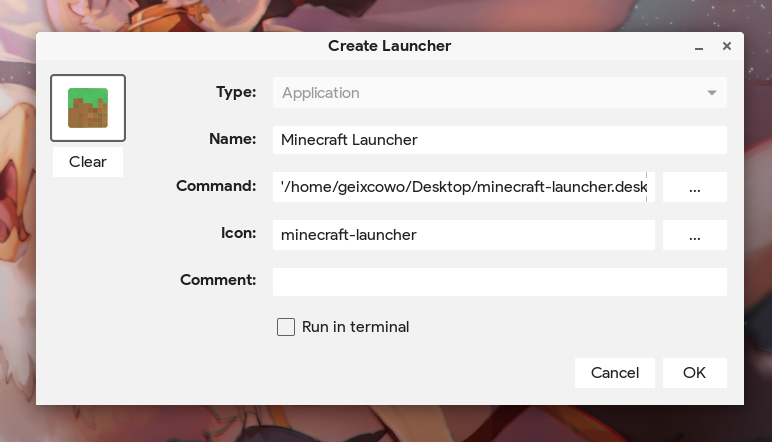
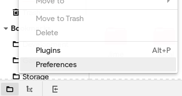
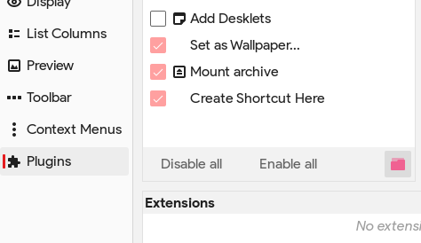
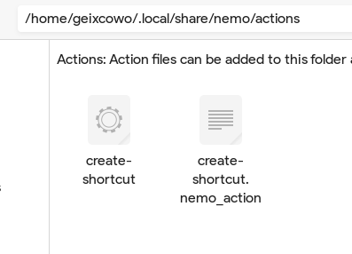
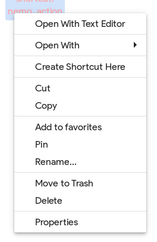
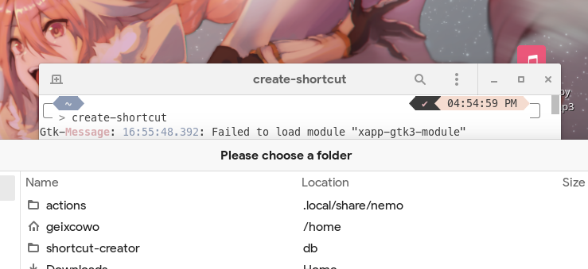

# create-shortcut-nemo-action
A Nemo Action that allows you to create .desktop files linking to a file, link, or directory of your choosing. (This action is also available as a stand-alone application!)

## Installation

To contribute, clone the repository to your local machine:
    
    git clone https://github.com/geixco/create-shortcut-nemo-action.git
    
To download, get the files from http://geixcowo.ga/create-shortcut-nemo-action.tar.gz and extract them to your local machine.

    tar -xvf create-shortcut-nemo-action.tar.gz

#### As a Nemo Action
1. Find Nemo's preferences in the **Edit** menu.

2. Click **Plugins** and then press the folder icon under the **Actions** heading.

3. Move the **create-shortcut** and the **create-shortcut.nemo_action** files into the newly opened Actions folder.

You can now use the **Create Shortcut Here** action within Nemo.

#### As a stand-alone application
1. Open a terminal and navigate to the directory where you downloaded the files.

        cd create-shortcut-nemo-action

2. Move the create-shortcut binary to where you want to install it. In this case, I installed it in /usr/local/bin.

        sudo mv create-shortcut /usr/local/bin/
3. Make the binary executable, if it isn't already.

        sudo chmod +x /usr/local/bin/create-shortcut

You can now use the **Create Shortcut** action from the terminal.

